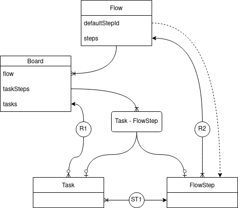

## To Do Manager

### Description
The aim of this library is, given a custom service, to provide a set of models and services to manage "to do" tasks. The library modeling is based in four simple concepts:

- **Task**: A "to do" task. Example: _"To buy milk"_" is a task.
- A **FlowStep** or state of a task: In which step or state the task is. As example: a task can be _pending_, _work in progress_ or _done_.
- A **Flow** is a collection of **FlowSteps**. That is: a collection of the possible states a task will "flow" through. Example: _{pending, WIP, done}_.
- A **Board** is an instance of a flow. For example, we can have a _shoping list_, _reading list_ or _preparatives for the wedding_ as different boards with the same associated flow _{pending, in progress, done}_.

##Turkish
##Bu kütüphanenin amacı, özel bir hizmet verildiğinde, "yapılacak" görevleri yönetmek için bir dizi model ve hizmet sağlamaktır. Kütüphane modellemesi dört basit kavrama dayanmaktadır:

##- **Görev**: Bir "yapılacak" görev. Örnek: _"Süt satın almak"_" bir görevdir.
##- Görevin **FlowStep** veya durumu: Görevin hangi adımda veya durumda olduğu. Örnek olarak: bir görev _beklemede_, _devam eden çalışma_ veya _bitti_ olabilir.
##- **Akış**, **FlowSteps**'in bir koleksiyonudur. Yani: bir görevin "akacağı" olası durumların bir koleksiyonu. Örnek: _{pending, WIP, done}.
##- **Pano** bir akışın örneğidir. Örneğin, aynı ilişkili akışa (_{pending, in progress, done}) sahip farklı panolar olarak bir _alışveriş listesi_, _okuma listesi_ veya _düğün hazırlıkları_'na sahip olabiliriz.

### Index

1. [Models](#models)
0. [Operators](#operators)
0. [Errors](#errors)


### <a name='models'></a> Models

1. [Introduction](#models--intro)
0. [Description](#models--descriptions)
0. [Extending models in your application](#models--extending-models)
0. [Other definitions](#models--definitions)

<a name='models--intro'></a>
>  From design, models used are plain objects.

The library use four main models: `ITask`, `IBoard`, `IFlow`, `IFlowStep`. A fifth model `IEntity` is implemented as a base model from which all previous four inherit properties.
The guards used internally infer the type of an entity (`ITask`, `IBoard`,...) from the property [`type: EntityType`](#models--definitions--entity-type), which mark the type of the entity.

From design, models are always plain objects, and can be extended in your application by using custom declaration files.
Also, the uniqueness of the relations _task_-_board_ [(R1)](#operators--source-operators--option-R1) and _flowStep_-_flow_ [(R2)](operators--source-operators--option-R2) are configurable.

The following diagram illustrates the relation between the main models.



#### <a name='models--descriptions'></a> Description
##### <a name='models--descriptions--entity'></a> `IEntity`

| Properties | Type | Description |
|---|---|---|
| `id?` | `undefined | Id`  | The identification of the object, provided by the input service. Notice that when an object is created, before being saved, it has an `undefined` id. In that case, if some process require the `id` to be executed, a `SavingRequiredError` will be raised. |
| `type` | `EntityType` | This field is used by the guards to identify which model is.|


##### <a name='models--descriptions--task'></a> `ITask`

Directly extends from [`IEntity`](#models--descriptions--entity) and does not add any property.


##### <a name='models--descriptions--board'></a> `IBoard`

| Properties | Type | Description |
|---|---|---|
| `flow` | `IFlow` | The flow this board is associated to. |
| `tasks` | `EntityCollection<ITask & ISaved>` | An [entity collection](#models--definitions--entity-collection) with the tasks contained in this board. |
| `taskSteps` | `Map<Id, Id>` | A map representing the state of a task in this board. The key `Id` represents the id of a board's task and the second `Id` represents the id of one of flowStep of the associated flow. |


##### <a name='models--descriptions--flow'></a> `IFlow`

| Properties | Type | Description |
|---|---|---|
| `steps` | `EntityCollection<IFlowStep & ISaved>` | An [entity collection](#models--definitions--entity-collection) with the steps of the flow. |
| `defaultStepId?` | `undefined | Id` | If provided, when a task is added to a board with this associated flow, the task will be assigned to that flowStep. |


##### <a name='models--flow-description--step'></a> `IFlowStep`

Directly extends from [`IEntity`](#models--descriptions--entity) and does not add any property.


#### <a name='models--extending-models'></a> Extending models in your application

Models have been design to be minimal, so in most of the cases your application will need for an extension.
Node provides a way make your own [_type definition declaration_ files](https://www.typescriptlang.org/docs/handbook/2/type-declarations.html#dts-files) so you can expand the typing of third party libraries.
Usually you have to be careful when doing that, because despite you are modifying the type _definition_, you are not changing the _implementation_.

This library has been implemented in a way that any included extra field is behaving as expected.

##### <a name='models--extending-models--example-1'></a> Example 1

Suppose the case for your application a name and optionally a description are needed for main models. Furthermore, suppose each flowStep is optionally associated to a color.

Then your `@types/todo-manager/index.d.ts` could look like the following and the functionality of the library would work as expected.

```typescript
// src/@types/todo-manager/index.d.ts
declare module 'todo-manager' {
  export type TFlowStepColor = 'red' | 'blue' | 'green';

  export interface ISaved {
    id: Id;
    createdAt: Date;
  }

  // entity
  export interface IEntity {
    id: Id;
    type: EntityType;
    createdAt?: Date;
    updatedAt?: Date;
    name: string;
    description?: string;
  }
  export interface IEntityCreationProps extends Omit<IEntity, 'id' | 'type' | 'createdAt'> {}
  export interface IEntityUpdateProps extends Partial<IEntityCreationProps> {}

  // task
  export interface ITask extends IEntity {
    type: EntityType.Task;
  }
  export interface ITaskCreationProps extends Omit<ITask, 'id' | 'type' | 'createdAt'> {}
  export interface ITaskUpdateProps extends Partial<ITaskCreationProps> {}

  // flow step
  export interface IFlowStep extends IEntity {
    type: EntityType.FlowStep;
    color?: TFlowStepColor;
  }
  export interface IFlowStepCreationProps extends Omit<IFlowStep, 'id' | 'type' | 'createdAt'> {}
  export interface IFlowStepUpdateProps extends Partial<IFlowStepCreationProps> {}

  // flow
  export interface IFlow extends IEntity {
    type: EntityType.Flow;
    steps: EntityCollection<IFlowStep>;
    defaultStepId?: Id;
    order: Id[];
  }
  export interface IFlowCreationProps extends Omit<IFlow, 'id' | 'type' | 'createdAt'> {}
  export interface IFlowUpdateProps extends Partial<IFlowCreationProps> {}

  // board
  export interface IBoard extends IEntity {
    type: EntityType.Board;
    flow: IFlow;
    tasks: EntityCollection<ITask>;
    taskSteps: Map<Id, Id>;
  }
  export interface IBoardCreationProps extends Omit<IBoard, 'id' | 'type' | 'createdAt'> {}
  export interface IBoardUpdateProps extends Partial<IBoardCreationProps> {}
}
```


#### <a name='models--definitions'></a> Other definitions
##### <a name='models--definitions--entity-type'></a>Entity type
```typescript
export enum EntityType {
  Task,
  Board,
  Flow,
  FlowStep
}
```

##### <a name='models--definitions--id'></a>Identificator


```typescript
export type Id = string | number | symbol;
```

##### <a name='models--definitions--entity-collection'></a>Entity collection


```typescript
export type EntityCollection<Entity> = Map<Id, Entity>;
```


##### <a name='models--definitions--any-entity'></a>Any Entity


```typescript
export type IAnyEntity = ITask | IFlowStep | IBoard | IFlow;
```


### <a name='operators'></a> Operators

1. [Introduction](#operators--intro)
0. [How to get the operators](#operators--get-provider)
0. [Source operators](#operators--source-operators)
0. [Operators description](#operators--description)
0. [Extending provided operators](#operators--extending)

<a name='operators--intro'></a> The main goal of the library is to provide operators to perform transformation to the objects. To do so, this library uses [_inversify_](https://inversify.io/) as dependency to provide a _container_ with the operators.
Concretely, the provided _container_ has injected five class instances with the operations as methods. So, in this way, operators are classified in five groups.

Since this library pretends to be a functional programming library, all the methods have the object `this` properly injected, so you can use them as a independent functions freely.
That also means that apply `.bind`, `.apply` or `.call` to the methods will not affect the `this` object used in the operators.

Also, to provide the _container_, a set of input operators to access the entities. Notice that by defining more or less operations, some output operators and functionalities will be available or not.


#### <a name='operators--get-provider'></a> How to get the operators

Two ways: If your application uses _inversify_, the library provides a `getContainer` which returns directly the container.

```typescript
// src/services/inversify.config.ts

import { Container } from 'inversify';
import { getContainer } from 'todo-manager';
import { sourceProvider } from './storage.provider';

const appContainerBase: Container = new Container();
/* ... Inject whatever ... */

export const appContainer = Container.merge(
  appContainerBase,
  getContainer({providers: {source: sourceProvider}})
);
```

```typescript
// other file
import { Identifiers, ITaskOperators } from 'todo-manager';
import { appContainer } from '~/services';

const taskOperators: container.get<ITaskOperators>(Identifiers.Task);
const task = await taskOperators.create({name: 'My task'});
```

However, if you do not want to use the _inversify_ way to obtain the operators, the exported function `getOperators` will perform the extraction for you:

```typescript
// src/services/index.ts

import { getOperators } from 'todo-manager';
import { sourceProvider } from './storage.provider';

const { task: taskOperators } = getOperators({providers: {source: sourceProvider}});
export taskOperators;
```

```typescript
// other file
import { taskOperators } from '~/services';

const task = await taskOperators.create({name: 'My task'});
```

> **Important:** Observe that when calling any of the two methods a **new container is generated**, meaning every one has injected different class instances.
So, in a standard application, _getOperators_ or _getContainer_ are called once and its result is exported and used application-wide.


#### <a name='operators--source-operators'></a> Source operators

In order to manage objects, the library needs access to them. Thus some basic operations should be provided.
The minimum needed from input operations are to get, set and delete an entity from a storage, or REST API or any source. Additionally, other operations can be given in exchange of more output functionalities.

The way to _provide_ that input operations is through a _source provider_, which is a function that returns an object containing the operations. That object will be injected to the container in singleton scope using `toDynamicValue` and an identifier stored in the object `Identifiers.Source`.

More concretely, that provider should match:

```typescript
import { interfaces } from 'inversify';

type MaybePromise<T> = Promise<T> | T;

export interface ISourceOperators {
  get: <E extends IEntity>(type: E['type']) => (id: Id) => MaybePromise<E & ISaved | undefined>;
  set: (entity: IEntity) => MaybePromise<IEntity | ISaved>;
  delete: (type: EntityType) => (id: Id) => MaybePromise<void>;
  // optional
  list?: <E extends IEntity>(type: E['type']) => MaybePromise<Iterable<E & ISaved>>;
  getTaskBoard?: (id: Id) => MaybePromise<IBoard & ISaved | undefined>;
  getStepFlow?: (id: Id) => MaybePromise<IFlow & ISaved>;
  getTasksWithStep?: (id: Id) => MaybePromise<Iterable<ITask & ISaved>>;
}

type TSourceProvider = (context: interfaces.Context) => ISourceOperators;
```

Let us explain each member:

##### `ISourceOperator.get`

Required. Given a `type` and `id`, it should return an entity of that `type` and `id`, or `undefined` if it does not exists.

##### `ISourceOperator.set`

Required. Called to "save" an `IEntity`. This process may or may not modify the actual entity data. In any case, the entity should be returned.

##### `ISourceOperator.delete`

Required. Called to "delete" an `IEntity`.

##### <a name='operators--source-operators--option-A1' ></a> Option (A1): `ISourceOperator.list`

Should return an iterable with all the entities of a given type.
If provided, operation [`list`](#operators--definition--entity--list) will be available. Otherwise, if the [`list`](#operators--definition--entity--list) operator is called, a [`NotImplementedError`](#errors--descriptions--not-implemented) will be raised.

##### <a name='operators--source-operators--option-R1' ></a> Option (R1): `ISourceOperator.getTaskBoard`

Should return _the_ board at which the task belongs, if any.

Provide to make your tasks to belong to at much at a unique board. Otherwise, one task belonging to several boards is allowed.
If provided, operations [`getBoard`](#operators--definition--task--get-board), [`getTaskStep`](#operators--definition--task-get-task-step) and [`setTaskStep`](#operators--definition--task--set-task-step) are available. Otherwise, if called, a [`NotImplementedError`](#errors--descriptions--not-implemented) will be raised.


##### <a name='operators--source-operators--option-R2' ></a> Option (R2): `ISourceOperator.getStepFlow`

Should return the _flow_ at which the _flowStep_ belongs.

Provide to make your _flowSteps_ to belong exactly to a unique flow. Otherwise, one _flowStep_ belonging to several flows is allowed.
If provided, operation [`getFlow`](#operators--definition--flow-step--get-flow) is available. Otherwise, if called, a [`NotImplementedError`](#errors--descriptions--not-implemented) will be raised.


##### <a name='operators--source-operators--option-ST1' ></a> Option (ST1): `ISourceOperator.getTasksWithStep`

Should return an iterable with the tasks whose state is that _flowStep_.

If provided, operation  [`getTasks`](#operators--definition--flow-step--get-tasks) and [`removeStep`](#operators--definition--flow--remove-step) are available. Otherwise, if called, a [`NotImplementedError`](#errors--descriptions--not-implemented) will be raised.


#### <a name='operators--description'></a> Operators description

The library provides the operators as methods classified in five classes.
Actually, they are not exactly javascript methods but getters returning an arrow function. This has the effect of them having the object `this` properly injected no matter how you call the method.

Also, all operators are pure functions.
So they are suitable for functional programming.


##### <a name='operators--description--entity'></a> Entity Operators

This is designed to perform general operations of entities.

```typescript
import { Identifiers, IEntityOperators } from 'todo-manager';

const entityOperators = getContainer({providers: {source: sourceProvider}}).get<IEntityOperators>(Identifiers.Entity);
// or
const { entity: entityOperators } = getOperators({providers: {source: sourceProvider}});
```

###### IEntityOperators.get

`get: (type: EntityType) => (id: Id) => Promise<IEntity & ISaved | undefined>`

Returns an entity by id from the source. `undefined` will be also returned if the type of the obtained entity does not match the expected type. 


###### IEntityOperators.getOrFail

`getOrFail: (type: EntityType) => (id: Id) => Promise<IEntity & ISaved>`

Returns an entity by id from the source or [`EntityNotFoundError`](#errors--descriptions--entity-not-found) is raised.
The error is also raised if the type of the received entity does not match the expected type.


###### IEntityOperators.list

Requires [A1](#operators--source-operators--option-A1)

`list: (type: EntityType) => Promise<EntityCollection<IEntity & ISaved>>`

Returns an entity collection with all the entities of a certain type.


###### IEntityOperators.save

`save: (entity: IEntity) => Promise<IEntity & ISaved>`

Save an entity. Notice that the returned entity could have updated the `id`, `createAt` or `updateAt` fields.


###### IEntityOperators.create

`create: (type: EntityType) => (props: IEntityCreationProps) => Promise<IEntity & ISaved>`

Creates an entity.


###### IEntityOperators.update

`update: (data: IEntityUpdateProps) => (entity: Entity) => IEntity`

Updates the current entity with new data.


###### IEntityOperators.delete

`delete: <E extends IEntity>(entity: E) => Promise<E>`

If entity is saved, request deletion to the source. Then returns a copy of the entity.


###### IEntityOperators.clone

`clone: <E extends IEntity>(entity: E) => E`

The identity function. Effectively, creates a copy of the entity.


###### IEntityOperators.refresh

`refresh: (entity: IEntity) => Promise<IEntity & ISaved | undefined>`

Update the entity from the source. Effectively, concatenates `getId` and `get`.


###### IEntityOperators.refreshOrFail

`refreshOrFail: (entity: IEntity) => Promise<IEntity & ISaved>`

Update the entity from the source. Effectively, concatenates `getId` and `getOrFail`.


###### IEntityOperators.getId

`getId: (entity: IEntity | Id) => Id`

If an `id` is passed, it just returns it. If an is entity passed, extracts the `id` from the entity. If entity is not saved a [`SavingRequiredError`](#errors--descriptions--saving-required) is thrown. 


###### IEntityOperators.getProp

`getProp: <K extends keyof IEntity>(prop: K) => (entity: IEntity) => IEntity[K]`

Extracts a property from the entity.


###### IEntityOperators.toCollection

`toCollection: <E extends IEntity>(entities: Iterable<E & ISaved>) => EntityCollection<E & ISaved>`

Creates a collection from an iterable of saved entities.


###### IEntityOperators.mergeCollections

`mergeCollections: <E extends IEntity>(collections: Iterable<EntityCollection<E & ISaved>>) => EntityCollection<E & ISaved>`

Merges several collections into a new single one.


###### IEntityOperators.requireSavedEntity

`requireSavedEntity: <E extends IEntity, RT extends any | undefined | null>(fn: (entity: E & ISaved) => RT) => (entity: E) => RT`

Requires the entity to have an `id`. Otherwise a [`SavingRequiredError`](#errors--descriptions--saving-required) is thrown.


##### <a name='operators--description--task'></a> Task Operators

Operators performed over `ITask`.

```typescript
import { Identifiers, ITaskOperators } from 'todo-manager';

const taskOperators = getContainer({providers: {source: sourceProvider}}).get<ITaskOperators>(Identifiers.Entity);
// or
const { task: taskOperators } = getOperators({providers: {source: sourceProvider}});
```

Have operators `save`, `update`, `delete`, `clone`, `refresh`, `getId` and `getProp` similarly to [entity operators](#operators--description--entity) but with the corresponding task models. In addition:


###### ITaskOperators.get

`get: (id: ITask & ISaved | Id) => Promise<ITask & ISaved | undefined>`

Returns a task by id from the source. If a task is provided, the entity is refreshed.


###### ITaskOperators.getOrFail

`getOrFail: (id: ITask & ISaved | Id) => Promise<ITask & ISaved>`

Returns a task by id from the source or [`EntityNotFoundError`](#errors--descriptions--entity-not-found) is raised. If a task is provided, the entity is refreshed.


###### ITaskOperators.list

`list: () => Promise<EntityCollection<ITask & ISaved>>`

Required [A1](#operators--source-operators--option-A1)

Returns an entity collection with all the tasks.


###### ITaskOperators.create

`create: (props: ITaskCreationProps) => Promise<ITask & ISaved>`

Creates a task.


###### ITaskOperators.getBoard

`getBoard: (task: ITask | Id) => Promise<(IBoard & ISaved) | undefined>`

Required [R1](#operators--source-operators--option-R1)

Returns the board at which task belongs, if any.


###### ITaskOperators.getTaskStep

`getTaskStep: (task: (ITask & ISaved) | Id) => Promise<(IFlowStep & ISaved) | undefined>`

Required [R1](#operators--source-operators--option-R1)

Returns the associated flowStep in its board, if any.


###### ITaskOperators.setTaskStep

`setTaskStep: (step: (IFlowStep & ISaved) | Id) => (task: (ITask & ISaved) | Id) => Promise<ITask & ISaved>`

Required [R1](#operators--source-operators--option-R1)

Assigns a flowStep to the task in its board. The operation on the board will be saved.

If task has no board as parent, a [`InvalidBoardAssociationError`](#errors--descriptions--invalid-board-association) will be raised.

If the flowStep is not valid, a [`InvalidFlowStepError`](#errors--descriptions--invalid-flow-step) will be raised.


##### <a name='operators--description--flow-step'></a> Flow Step Operators

Operators performed over `IFlowStep`.

```typescript
import { Identifiers, IFlowStepOperators } from 'todo-manager';

const flowStepOperators = getContainer({providers: {source: sourceProvider}}).get<IFlowStepOperators>(Identifiers.Entity);
// or
const { flowStep: flowStepOperators } = getOperators({providers: {source: sourceProvider}});
```

Have operators `save`, `update`, `delete`, `clone`, `refresh`, `getId` and `getProp` similarly to [entity operators](#operators--description--entity) but with the corresponding flowStep models. In addition:


###### IFlowStepOperators.get

`get: (id: IFlowStep | Id) => Promise<IFlowStep | undefined>`

Returns a flow step by id from the source. If a flowStep is provided the entity is refreshed.


###### IFlowStepOperators.getOrFail

`getOrFail: (id: IFlowStep | Id) => Promise<IFlowStep>`

Returns a flowStep by id from the source or [`EntityNotFoundError`](#errors--descriptions--entity-not-found) is raised. If a flowStep is provided the entity is refreshed.


###### IFlowStepOperators.list

`list: () => Promise<EntityCollection<IFlowStep & ISaved>>`

Required [A1](#operators--source-operators--option-A1)

Returns an entity collection with all the flowSteps.


###### IFlowStepOperators.create

`create: (props: IFlowStepCreationProps) => Promise<IFlowStep & ISaved>`

Creates a flowStep.


###### IFlowStepOperators.getFlow

`getFlow: (flowStep: IFlowStep | Id) => Promise<IFlow & ISaved>`

Required [R2](#operators--source-operators--option-R2)

Returns the flow at which flow step belongs. 


###### IFlowStepOperators.getTasks

`getTasks: (flowStep: IFlowStep | Id) => Promise<EntityCollection<ITask & ISaved>>`

Required [ST1](#operators--source-operators--option-ST1)

Returns the associated tasks.


##### <a name='operators--description--flow'></a> Flow Operators

Operators performed over `IFlow`.

```typescript
import { Identifiers, IFlowOperators } from 'todo-manager';

const flowOperators = getContainer({providers: {source: sourceProvider}}).get<IFlowOperators>(Identifiers.Entity);
// or
const { flow: flowOperators } = getOperators({providers: {source: sourceProvider}});
```

Have operators `save`, `update`, `delete`, `clone`, `refresh`, `getId` and `getProp` similarly to [entity operators](#operators--description--entity) but with the corresponding flow models. In addition:


###### IFlowOperators.get

`get: (id: IFlow | Id) => Promise<IFlow | undefined>`

Returns a flow by id from the source. If a flow is provided the entity is refreshed.


###### IFlowOperators.getOrFail

`getOrFail: (id: IFlow | Id) => Promise<IFlow>`

Returns a flow by id from the source or [`EntityNotFoundError`](#errors--descriptions--entity-not-found) is raised. If a flow is provided the entity is refreshed.


###### IFlowOperators.list

`list: () => Promise<EntityCollection<IFlow & ISaved>>`

Required [A1](#operators--source-operators--option-A1)

Returns an entity collection with all the flows.


###### IFlowOperators.create

`create: (props: IFlowCreationProps) => Promise<IFlow & ISaved>`

Creates a flow.


###### IFlowOperators.getSteps

`getSteps: (flow: IFlow | Id) => EntityCollection<IFlowStep & ISaved>`

Returns the flowSteps belonging to the flow. 


###### IFlowOperators.addStep

`addStep: (flowStep: IFlowStep | Id) => (flow: IFlow | Id) => Promise<IFlow>`

Required either _not_ [R2](#operators--source-operators--option-R2) or [ST1](#operators--source-operators--option-ST1)

Adds a flowStep to the flow.
If option [R2](#operators--source-operators--option-R2) is selected, the flowStep will be first removed from the current parent, and the operation will be saved.
If the current flowStep have associated tasks, an error [`FlowStepInUseError`](#errors--descriptions--flow-step-in-use) will be raised.


###### IFlowOperators.removeStep

`removeStep: (flowStep: IFlowStep | Id) => (flow: IFlow | Id) => Promise<IFlow>`

Required [ST1](#operators--source-operators--option-ST1)

Removes a flowStep from the flow.
If the current flowStep have associated tasks, an error [`FlowStepInUseError`](#errors--descriptions--flow-step-in-use) will be raised.


##### <a name='operators--description--board'></a> Board Operators

Operators performed over `IBoard`.

```typescript
import { Identifiers, IBoardOperators } from 'todo-manager';

const boardOperators = getContainer({providers: {source: sourceProvider}}).get<IBoardOperators>(Identifiers.Entity);
// or
const { board: boardOperators } = getOperators({providers: {source: sourceProvider}});
```

Have operators `save`, `update`, `delete`, `clone`, `refresh`, `getId` and `getProp` similarly to [entity operators](#operators--description--entity) but with the corresponding board models. In addition:


###### IBoardOperators.get

`get: (id: IBoard | Id) => Promise<IBoard | undefined>`

Returns a board by id from the source. If a board is provided the entity is refreshed.


###### IBoardOperators.getOrFail

`getOrFail: (id: IBoard | Id) => Promise<IBoard>`

Returns a board by id from the source or [`EntityNotFoundError`](#errors--descriptions--entity-not-found) is raised. If a board is provided the entity is refreshed.


###### IBoardOperators.list

`list: () => Promise<EntityCollection<IBoard & ISaved>>`

Required [A1](#operators--source-operators--option-A1)

Returns an entity collection with all the boards.


###### IBoardOperators.create

`create: (props: IBoardCreationProps) => Promise<IBoard & ISaved>`

Creates a board.


###### IBoardOperators.addTask

`addTask: (task: (ITask & ISaved) | Id) => (board: IBoard | Id) => Promise<IBoard>`

Adds a task to the board. If [R1](#operators--source-operators--option-R1) is set, first the task will be removed from its current board. That operation will be saved.


###### IBoardOperators.removeTask

`removeTask: (task: (ITask & ISaved) | Id) => (board: IBoard | Id) => Promise<IBoard>`

Removes a task from the board.


###### IBoardOperators.hasTask

`hasTask: (task: (ITask & ISaved)| Id) => (board: IBoard | Id) => Promise<boolean>`

Returns `true` if the board has the task, `false` otherwise.


###### IBoardOperators.getTaskStepId

`getTaskStepId: (task: (ITask & ISaved) | Id) => (board: IBoard | Id) => Proimse<Id>`

Returns the flowStep's `id` associated to the task in the context of the board.


###### IBoardOperators.getTaskStep

`getTaskStep: (task: (ITask & ISaved) | Id) => (board: IBoard | Id) => Promise<IFlowStep & ISaved>`

Returns the flowStep associated to the task in the context of the board.


###### IBoardOperators.setTaskStep

`setTaskStep: (step: (IFlowStep & ISaved) | Id) => (task: (ITask & ISaved) | Id) => (board: IBoard) => Promise<IBoard>`

Set a task's state to a flowStep in the context of the board.


#### <a name='operators--extending'></a> Extending operators

All five entity, task, flowStep, flow and board operators can be extended or override by providing a new class.
The following example illustrates how it can be done:

```typescript
// src/services/inversify.config.ts

import { Container } from 'inversify';
import { getContainer } from 'todo-manager';
import { SourceOperators } from './storage';
import { TaskOperators } from './task';
import { FlowStepOperators } from './flow-step';
import { FlowOperators } from './flow';
import { BoardOperators } from './board';

const appContainerBase: Container = new Container();
/* ... Inject whatever ... */


export const appContainer = Container.merge(
  appContainerBase,
  getContainer({
    providers: {
      source: (context) => new SourceOperators(),
      task: (context) => new TaskOperators(context),
      flowStep: (context) => new FlowStepOperators(context),
      flow: (context) => new FlowOperators(context),
      board: (context) => new BoardOperators(context),
    }
  });
);
```


### <a name='errors'></a>Errors

1. [Introduction](#errors--intro)
0. [Descriptions](#errors--descriptions)
0. [Extending errors](#errors--extending-errors)

<a name='errors--intro'></a>
The library provides errors with the objective of catching and handling invalid actions or wrong parameters and distinguish them from unexpected errors.

#### <a name='errors--descriptions'></a> Descriptions

The following errors are implemented:

- [`TodoManagerError`](#errors--descriptions--todo-manager)
- [`NotImplementedError`](#errors--descriptions--not-implemented)
- [`EntityNotFoundError`](#errors--descriptions--entity-not-found)
- [`SavingRequiredError`](#errors--descriptions--saving-required)
- [`BoardTaskWithoutStepError`](#errors--descriptions--board-task-without-step)
- [`InvalidFlowStepError`](#errors--descriptions--invalid-flow-step)
- [`FlowStepInUseError`](#errors--descriptions--flow-step-in-use)
- [`InvalidBoardAssociationError`](#errors--descriptions--invalid-board-association)

##### <a name='errors--descriptions--todo-manager'></a> `TodoManagerError`

Extends from `Error`.

**Description:** Base error for extending all library errors as well as the application ones.


##### <a name='errors--descriptions--not-implemented'></a> `NotImplementedError`

Extends from `TodoManagerError`.

**Description:** Tried to access some property or perform an action not available with the current configuration.

**Example** To try to call `getBoard` on a task when configuration does not assert uniqueness of boards on tasks.


##### <a name='errors--descriptions--entity-not-found'></a> `EntityNotFoundError`

Extends from `TodoManagerError`.

**Description:** Operation expected an entity but no entity is not obtained, or the obtained entity has not the expected type.

**Example** To call `getOrFail` expecting a task and receiving a board.


##### <a name='errors--descriptions--saving-required'></a> `SavingRequiredError`

Extends from `TodoManagerError`.

**Description:** Tried to access some property or perform an action over an instance without id that requires that object to be saved.

**Example** To try to attach a recently created task to a board will raise that error.


##### <a name='errors--descriptions--board-task-without-step'></a> `BoardTaskWithoutStepError`

Extends from `TodoManagerError`.

**Description:** Tried to attach a task without indicating the flowStep to a board without `defaultStepId`


##### <a name='errors--descriptions--invalid-flow-step'></a> `InvalidFlowStepError`

Extends from `TodoManagerError`.

**Description:** Tried to change a task from current flowStep to an invalid flowStep

**Example** In a context of a board, when associated flow have defined `allowedNextIds` and try to change task's flowStep to another flowStep which is not in the first's `allowedNextIds` set.


##### <a name='errors--descriptions--flow-step-in-use'></a> `FlowStepInUseError`

Extends from `TodoManagerError`.

**Description:** Tried to perform some action over a flowStep that required to not to have any task associated.

**Example:** To try to delete a flowStep with some associated task.


##### <a name='errors--descriptions--invalid-board-association'></a> `InvalidBoardAssociationError`

Extends from `TodoManagerError`.

**Description:** Tried to perform some action over or with an entity not associated to a correct board.

**Example:** To try assign a flowStep to a task with a board which a flow which has not the flowStep.


#### <a name='errors--extending-errors'></a> Extending errors

The provided errors are designed to cover a general purpose cases of logically invalid actions. But it may happen that for your application logic other cases of invalid actions happen.
If so, it is a good idea to create an error based of [`TodoManagerError`](#errors--descriptions--todo-manager) as follows.

```typescript
export class MyCustomInvalidActionError extends TodoManagerError {
  constructor(m: string) {
    super(m);
    Object.setPrototypeOf(this, MyCustomInvalidActionError.prototype);
  }
}
```
